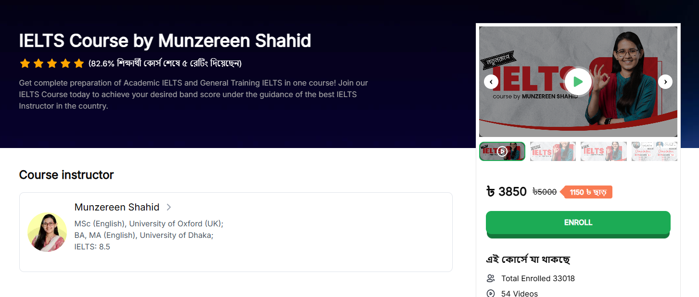

# 🚀 IELTS Course Landing Page



🌐 **Live Demo:** [https://ten-min-scl.vercel.app](Visit the Project Here)

---

## 🎯 Project Overview

Welcome to the **IELTS Course Landing Page**!  
A modern, blazing-fast, and SEO-friendly landing page built with **Next.js 15**, **TypeScript**, and **TailwindCSS**.  
Designed to deliver an excellent user experience on all devices with **SSR**, **ISR**, and smooth client-side interactions.

---

## ✨ Key Features

- 🔥 **Next.js 15** with latest App Router & React 18  
- 🌍 **Localization**: English & Bengali language support based on user cookies  
- ⚡️ **Server-Side Rendering (SSR)** for blazing SEO & fast initial load  
- ⏳ **Incremental Static Regeneration (ISR)** for fresh data without full rebuilds  
- 🎬 Embedded **YouTube course trailer**  
- 📚 Dynamic course content fetched from API (`instructors`, `features`, `pointers`, `about`)  
- 💸 Fixed course price with clear **CTA button**  
- ✅ Interactive **checklist** for course benefits  
- 📱 Fully **responsive** on mobile, tablet, and desktop  
- 🧩 **Code splitting** with dynamic imports for faster load and optimized bundles  
- 🎨 Stylish UI powered by **TailwindCSS** with accessibility in mind  

---

## ⚙️ Project Setup

Follow these easy steps to get started locally and explore:

```bash
# 1. Clone the repo
git clone https://github.com/yourusername/ielts-course-landing.git
cd ielts-course-landing

# 2. Install dependencies
npm install
# or
yarn install

# 3. Run development server
npm run dev
# or
yarn dev

# 4. Open your browser
http://localhost:3000
